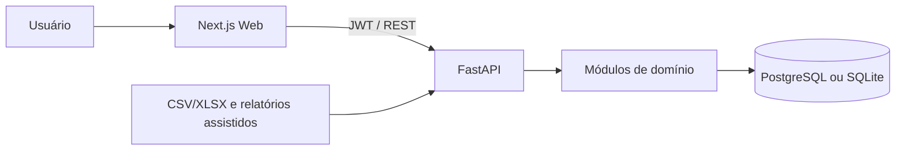

# ARQUITETURA.md — Arquitetura do Sistema

**Projeto:** Ilex Logística
**Atualizado em:** 2026-07-02
**Status:** MVP avançado em estabilização; não pronto para produção

## 1. Visão geral

Aplicação web para centralizar dados logísticos, importar entregas, monitorar envios e SLA, tratar exceções e apoiar decisões por indicadores e relatórios.

## 2. Stack identificada

| Camada | Tecnologia confirmada |
|---|---|
| API | Python >=3.11, FastAPI, Pydantic, SQLAlchemy 2 |
| Persistência | PostgreSQL 16 no Docker; SQLite suportado em desenvolvimento/testes; Alembic |
| Segurança | JWT, bcrypt/passlib, RBAC por papéis e permissões |
| Web | Next.js 16 App Router, React 19, TypeScript 5, Tailwind CSS 4 |
| Testes | pytest, Vitest, Testing Library, Playwright |
| Infra | Docker Compose; CI atual **NÃO IDENTIFICADO NO WORKTREE** |
| Observabilidade | Logging da aplicação e logs Docker; plataforma externa **NÃO IDENTIFICADA** |

## 3. Estrutura

```text
/
├── apps/api/       # API, models, migrations e testes
├── apps/web/       # aplicação Next.js e testes
├── infra/          # Docker e setup local
├── scripts/        # gates de qualidade e segurança
├── docs/           # documentação técnica remanescente
└── *.md            # governança e fontes de escopo
```

## 4. Arquitetura geral

Monorepo com SPA/SSR Next.js consumindo API REST modular FastAPI. A API usa routers, services, schemas Pydantic e models SQLAlchemy sobre banco relacional.



## 5. Módulos confirmados

| Módulo | Responsabilidade | Evidência | Status |
|---|---|---|---|
| Auth | login e refresh JWT | `modules/auth` | Funcional |
| Users/RBAC | usuários, papéis e permissões | `modules/users` | Funcional |
| Carriers | cadastro e inativação | `modules/carriers` | Funcional |
| Imports/Deliveries | preview, confirmação, histórico e promoção | `modules/imports` | Funcional |
| Shipments | listagem, detalhe, importação e tratativas | `modules/shipments` | Funcional |
| SLA | regras e recálculo | `modules/sla` | Funcional |
| Analytics | eficiência e exceções | `shipments/analytics_service.py` | Funcional |
| Dashboard | resumo e tendência | `modules/dashboard` | Funcional |
| Alerts | geração, leitura, resolução e entrega | `modules/alerts` | Funcional |
| Reports | geração, consulta e exportação diária | `modules/reports` | Funcional |
| Audit | logs operacionais e resumo | `modules/audit` | Funcional |
| Freight Quotes | cotação por pedido | nenhuma evidência de domínio | Planejado |

## 6. Fluxos principais

### Autenticação e autorização

Credenciais entram em `/auth/login`; a API emite access/refresh tokens. Dependências de autorização verificam usuário e permissões. O Web guarda sessão, protege rotas via middleware e trata `401/403`.

### Importação e promoção

Arquivo CSV/XLSX entra em preview, passa por mapeamento e validação, é confirmado e gera histórico/deliveries. Uma delivery validada pode ser promovida a shipment. Erros de formato, colunas ou duplicidade são retornados ao operador.

### Monitoramento operacional

Shipments são filtrados e enriquecidos por SLA. Tratativas registram ações. Serviços analíticos agregam exceções e eficiência; dashboard, alertas e relatório diário consomem esses resultados.

### Cotação assistida especificada

Pedidos ERP por CSV/XLSX gerarão rodadas imutáveis com uma cotação por transportadora. Entrada de resultados será manual pela Web ou CSV; seleção automática e override auditado pertencem ao domínio da API. Persistência e rotas serão implementadas no módulo `orders`.

## 7. Integrações externas

| Integração | Finalidade | Status |
|---|---|---|
| Braspress por relatório | importação assistida | Confirmada por mapper e fixtures/testes |
| ERP | entrada de pedidos para cotação | A CONFIRMAR |
| APIs de transportadoras | rastreio/cotação automática | A CONFIRMAR |
| E-mail/notificações externas | entrega de alertas/relatórios | PENDENTE DE VALIDAÇÃO |

## 8. Segurança

JWT e RBAC protegem os módulos. Schemas Pydantic validam contratos. Em produção, a configuração rejeita JWT fraco/default, SQLite, debug, CORS inseguro, PostgreSQL placeholder e Redis ausente. Redis aplica limites por IP/usuário; indisponibilidade bloqueia tráfego produtivo com `503`. Headers defensivos são adicionados a todas as respostas e HSTS somente no ambiente produtivo com TLS. O Web não possui login alternativo/bypass.

## 9. Execução e testes

```powershell
cd apps/api
pip install -e ".[dev]"
python -m pytest -q

cd ../web
npm ci
npm test
npm run build

cd ../../infra
docker compose up -d
```

## 10. Pontos de atenção

- Existem dois conceitos de entrada (`Delivery` e `Shipment`); a promoção deve continuar explícita.
- Regras de eficiência dependem da definição homologada de SLA/status.
- Cotações exigirão novas fronteiras de domínio, migrations, API e telas.
- Documentação histórica removida continua consultável pelo Git, mas não deve ser tomada como estado atual sem inspeção do código.
- O Web não fecha build, testes ou lint na auditoria de 2026-07-02; detalhes e prioridades estão em `AUDITORIA.md`.
- Não há workflow ativo em `.github/workflows`; os gates ainda dependem de execução local.
- A suíte completa da API precisa de diagnóstico de duração/isolamento antes de ser considerada verde.
