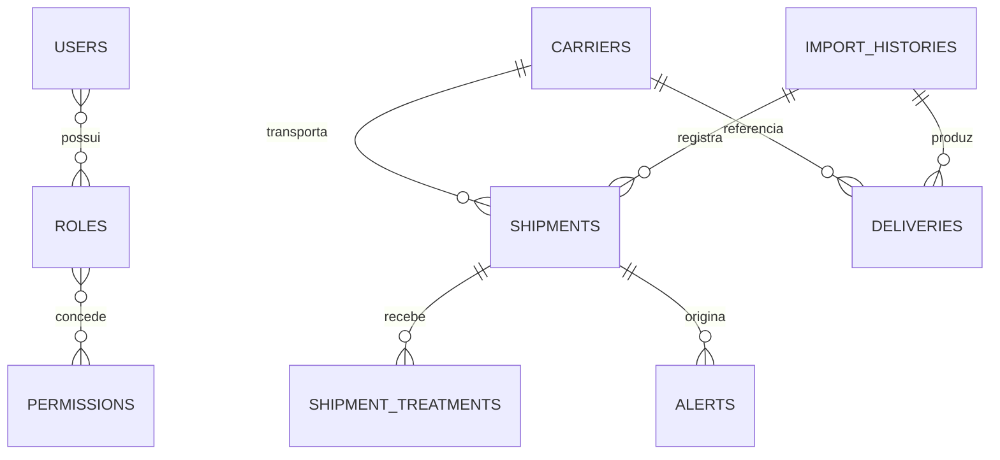

# BANCO_DADOS.md — Arquitetura de Banco de Dados

**Projeto:** Ilex Logística
**Atualizado em:** 2026-07-02
**Banco:** PostgreSQL 16 no ambiente Docker; SQLite suportado em desenvolvimento/testes

## 1. Visão geral

A persistência usa SQLAlchemy 2 e migrations Alembic. A URL é fornecida por configuração; valores sensíveis não devem aparecer em documentação.

## 2. Localização

| Tipo | Caminho |
|---|---|
| Base e sessão | `apps/api/app/database/` |
| Models | `apps/api/app/modules/*/models.py` |
| Migrations | `apps/api/migrations/versions/` |
| Alembic | `apps/api/alembic.ini`, `apps/api/migrations/env.py` |
| Testes | `apps/api/tests/test_database.py`, `test_migrations.py` |

## 3. Modelo lógico confirmado



Alguns vínculos podem ser opcionais ou armazenados por identificador textual conforme o model; o diagrama representa o domínio, não garante todas as foreign keys. Relações exatas devem ser confirmadas no model/migration antes de mudar schema.

## 4. Entidades

| Entidade | Finalidade | Model |
|---|---|---|
| `users`, `roles`, `permissions`, associação de papéis | identidade e RBAC | `modules/users/models.py` |
| `carriers` | transportadoras | `modules/carriers/models.py` |
| `import_histories` | auditoria de importações | `modules/imports/models.py` e legado em shipments |
| `deliveries` | linhas validadas antes da promoção | `modules/imports/models.py` |
| `shipments` | entregas monitoradas e campos fiscais/SLA | `modules/shipments/models.py` |
| `shipment_treatments` | tratativas operacionais | `modules/shipments/models.py` |
| `sla_rules` | parâmetros de prazo | `modules/sla/models.py` |
| `alerts` | alertas operacionais | `modules/alerts/models.py` |
| `alert_delivery_logs` | tentativas/estado de entrega | `modules/alerts/models.py` |
| `daily_reports` | snapshots de relatório | `modules/reports/models.py` |
| `operational_audit_logs` | auditoria operacional | `modules/audit/models.py` |

### Shipments — campos complementares

O model e as migrations incluem campos fiscais/financeiros associados ao Apêndice 1, entre eles número e valor da nota fiscal, valor/percentual do frete e data de coleta. Tipos, nulabilidade, defaults e nomes físicos devem ser obtidos diretamente da migration vigente antes de qualquer alteração.

### Entidades ainda ausentes

`orders` e `freight_quotes` não foram identificadas. O futuro schema deverá, no mínimo, representar pedido externo, transportadora, valor cotado, status, mensagem operacional, validade e histórico, mas o desenho físico depende de especificação/ADR.

## 5. Migrations identificadas

| Ordem | Migration | Finalidade resumida |
|---|---|---|
| 1 | `20260513_01_initial_foundation.py` | fundação |
| 2 | `20260514_02_import_histories.py` | histórico de importação |
| 3 | `20260514_03_deliveries.py` | deliveries |
| 4 | `20260515_01_add_shipments.py` | shipments |
| 5 | `20260515_02_add_import_counts.py` | contadores de importação |
| 6 | `20260515_04_add_fiscal_fields.py` | campos fiscais |
| 7 | `20260608_01_add_fiscal_financial_fields.py` | campos fiscais/financeiros |
| 8 | `20260610_01_add_import_history_metadata.py` | metadados de importação |
| 9 | `20260615_01_create_sla_rules.py` | regras de SLA |
| 10 | `20260620_01_create_alerts.py` | alertas |
| 11 | `20260620_02_add_alert_delivery_logs.py` | log de entrega de alertas |
| 12 | `20260621_01_create_daily_reports.py` | relatórios diários |
| 13 | `20260622_01_create_operational_audit_logs.py` | auditoria operacional |
| 14 | `20260623_01_add_permissions.py` | permissões |
| 15 | `20260624_01_add_carriers_permissions.py` | permissões de transportadoras |
| 16 | `20260627_01_create_alert_delivery_logs.py` | evolução de logs de entrega |

Não editar migrations antigas já aplicadas; criar uma nova revisão. A coexistência de duas migrations relacionadas a `alert_delivery_logs` deve ser preservada e validada pelo encadeamento Alembic.

### Estado auditado do encadeamento

Em 2026-07-02, a bifurcação foi consolidada antes de qualquer uso compartilhado. A criação duplicada incompatível foi removida, o schema de `alert_delivery_logs` foi alinhado ao contrato de entrega de notificações e o histórico passou a possuir uma única head. Banco novo e roundtrip foram validados.

## 6. Operação

```powershell
cd apps/api
alembic upgrade head
alembic downgrade -1
python -m pytest -q tests/test_migrations.py

cd ../..
python scripts/validate_migrations.py
```

Antes de migration: backup no ambiente alvo, teste upgrade/downgrade, revisão de nulabilidade/defaults e plano de compatibilidade. Seeds de demonstração existem em `apps/api/seed_demo.py`; uso em produção não é autorizado.

## 7. Segurança e desempenho

- Nunca registrar a string real de conexão.
- Índices de filtros frequentes (status, transportadora, datas, NF e rastreio) devem ser confirmados antes de otimizações.
- Imports e cotações futuras precisam de chaves de idempotência/constraints contra duplicidade.
- Retenção de auditoria, relatórios e histórico de cotação está **A CONFIRMAR**.
