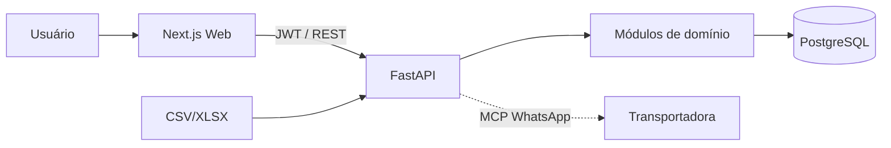

# Runbook do Ilex Logística

**Documento:** Manual operacional e comercial do produto
**Público:** administradores, gestores, equipe de logística, auditoria e novos desenvolvedores
**Atualizado em:** 2026-07-16
**Status do produto:** MVP avançado consolidado, em homologação (UAT pendente para alguns módulos)

> Este runbook descreve **como o sistema funciona na prática** e **como usar corretamente cada função**. Para detalhes técnicos de contrato, leia `ARQUITETURA.md`; para regras de cada domínio, leia `docs/specs/`; para o plano de entrega, leia `ROADMAP.md`.

---

## 1. Visão comercial

O **Ilex Logística** é uma plataforma web que centraliza o acompanhamento de entregas de múltiplas transportadoras. Em vez de planilhas isoladas e consultas manuais em portais diferentes, a operação ganha um único ambiente para:

- **importar** dados logísticos (CSV/XLSX, inclusive relatórios Braspress);
- **monitorar** envios, prazos, atrasos e criticidade;
- **agir** sobre exceções com tratativas registradas;
- **comparar** eficiência e custo por transportadora;
- **decidir** com dashboard, alertas e relatórios gerenciais;
- **auditar** cada ação relevante;
- **cotar frete por pedido** (MVP assistido) antes da expedição;
- **cobrar remessas atrasadas** via WhatsApp (integração MCP, SPEC-13).

**Diferenciais comerciais:** visão operacional e gerencial no mesmo lugar; implantação gradual a partir de arquivos já disponíveis; arquitetura preparada para novas transportadoras e integrações; acesso por perfil; rastreabilidade das decisões; evolução orientada por especificações e validação contínua.

**Para quem:** equipe de logística (ação diária), gestores (KPIs), administração (usuários/parâmetros) e auditoria/backoffice (histórico).

---

## 2. Como o sistema funciona (jornada operacional)

```text
Importar dados (CSV/XLSX ou Braspress)
        ↓
Validar, visualizar e confirmar entregas
        ↓
Calcular SLA, atraso e criticidade automaticamente
        ↓
Destacar atrasos, exceções e falta de atualização
        ↓
Registrar tratativas (o que foi feito, por quem, quando)
        ↓
Acompanhar indicadores, alertas e relatório diário
        ↓
(Opicional) Disparar cobrança WhatsApp para transportadoras com atraso
```

### Arquitetura em uma frase
Um frontend **Next.js** consome uma **API REST FastAPI** (modular, com JWT/RBAC) que persiste em **PostgreSQL** (Docker) e versiona o schema com **Alembic**.



---

## 3. Acesso e perfis

O acesso é controlado por **login (e-mail/senha)** que emite tokens JWT. Cada usuário tem um **papel (role)** que define suas **permissões**. As telas e botões aparecem conforme o perfil.

| Papel | O que pode fazer (resumo) |
|---|---|
| `admin` | tudo: usuários, transportadoras, regras, parâmetros, auditoria, importações, envios, alertas, relatórios, pedidos e cotações |
| `manager` | gestão e leitura ampla; grava alertas/relatórios/SLA; override de cotação; **não** edita usuários/transportadoras |
| `gestor` | leitura gerencial (envios, alertas, relatórios, carriers, pedidos); override de cotação |
| `logistica` | opera envios, importações, transportadoras, pedidos e cotações |
| `operator` | opera envios, importações, pedidos e cotações (sem carriers/alertas/relatórios) |
| `viewer` | leitura de envios, importações, SLA, alertas, relatórios, carriers e pedidos |
| `auditoria` | leitura de auditoria, envios, importações, carriers e pedidos (sem escrita) |

**Regra prática:** se um botão ou tela não aparece, o perfil não tem a permissão. A cobrança WhatsApp exige `shipments:write` + `shipments:read` (perfis `admin`, `logistica`, `operator`).

> Nunca compartilhe senha nem token. O Web não possui bypass de login. Tentativas sem token retornam `401`; sem permissão, `403`.

---

## 4. Funções e capacidades (por tela)

### 4.1 Dashboard — `/dashboard`
Visão executiva com KPIs (total de envios, atrasos, críticos, percentual de atraso), resumo e tendência temporal. Use os filtros de período para alinhar KPIs e ranking com a mesma janela das listagens.

### 4.2 Envios — `/shipments`
O coração operacional.
- **Listagem e busca:** por NF, cliente, rastreio, UF e transportadora.
- **Filtros combináveis:** status, transportadora, cliente, UF, mês/ano, criticidade, SLA (no prazo/atenção/atrasado/crítico), atraso, faixas de valor/frete/percentual.
- **Ordenação e paginação** server-side (coerentes com o filtro).
- **Novo envio:** cadastro manual de remessa (rastreio, transportadora, prazo, cliente, destinatário, endereços, NF, valores).
- **Detalhe:** `/shipments/[id]` mostra dados fiscais/financeiros, histórico e tratativas.
- **Disparar cobrança:** botão (perfis com `shipments:write`) que abre o modal de cobrança WhatsApp (ver seção 6).

### 4.3 Importações — `/shipments/import`
Entrada assistida de dados.
- **Preview** sem persistir: valida colunas, tipos, tamanho, encoding, duplicidades e fórmulas perigosas.
- **Confirmação transacional e idempotente:** grava somente após aprovação; erro é reportado **por linha**.
- Formatos: CSV e XLSX (layout Braspress suportado por mapper dedicado).

### 4.4 Deliveries e promoção — `/shipments/deliveries`
Registros de entrada (ex.: relatório Braspress). Uma delivery validada pode ser **promovida a shipment** (envio monitorado), mantendo a separação explícita entre as duas entidades.

### 4.5 Transportadoras — `/carriers`
Cadastro, edição, listagem e inativação de transportadoras. Campos: nome, código externo, **WhatsApp** (usado na cobrança), e-mail e metadados de integração (JSON).
- Botão **"Cobrar"** por transportadora abre o modal de cobrança já filtrado para aquele carrier.

### 4.6 Exceções — `/exceptions` e `/shipments/analytics/exceptions`
Painel direcionado aos casos que exigem intervenção (atraso, criticidade, falta de atualização). Use para priorizar o dia.

### 4.7 Eficiência por transportadora — `/shipments/analytics/carrier-efficiency`
Comparação por transportadora e período: total de NFs/entregas, no prazo, atrasadas, extraviadas, frete total e percentual médio de frete. Ranking determinístico (desempate explícito). Apoia negociação e escolha de transportadora.

### 4.8 SLA — `/settings/sla`
Regras de prazo, aviso e atraso crítico por transportadora/UF. O "no prazo" e a criticidade dependem dessas regras — homologue-as com a operação.

### 4.9 Alertas — `/alerts`
Geração, leitura e resolução de alertas operacionais. Cada alerta pode ter log de entrega (`AlertDeliveryLog`); o canal `whatsapp` é usado pela rotina de cobrança (SPEC-13).

### 4.10 Relatório diário — `/reports/daily`
Consolidação das ocorrências do dia (totais, exceções, por criticidade, por transportadora, import failures). Geração e consulta histórica.

### 4.11 Pedidos e cotações — `/orders`, `/orders/[id]`, `/quote-rounds/[id]`
MVP assistido de cotação de frete por pedido.
- Importe pedidos do ERP por CSV/XLSX padronizado.
- Crie rodadas com uma cotação por transportadora ativa (status `pendente`, `cotado`, `indisponivel`, `erro`, `vencido`).
- A melhor opção é destacada de forma **determinística** (menor valor válido; desempate por ordem estável).
- **Override justificado e auditado** é permitido e preserva o histórico da rodada.

### 4.12 Auditoria — `/audit`
Histórico de eventos operacionais (quem, quando, o quê). Leitura para backoffice e conformidade.

### 4.13 Usuários — `/users`
Gestão de usuários, papéis e permissões (admin). Respeita a matriz RBAC do backend.

---

## 5. Cálculos que o sistema faz (e o que ele NÃO faz)

- **Percentual de frete:** `(valor_frete / valor_nota_fiscal) * 100`. Fica indisponível se algum valor estiver ausente ou se a NF ≤ 0. Valores monetários usam decimal (nunca ponto flutuante binário na persistência).
- **Atraso (dias):** diferença entre prazo e realização; alimenta SLA e criticidade.
- **Criticidade:** `normal | baixa | media | alta` conforme regra de SLA homologada.
- **Eficiência:** no prazo vs atrasado/extraviado por transportadora, no período filtrado.

**Fora de escopo:** pagamentos, faturamento, roteirização de frota, marketplace, captcha/portal de terceiros e qualquer API de terceiro sem contrato e homologação.

---

## 6. Cobrança WhatsApp de remessas atrasadas (SPEC-13 / LOG-042–043)

Funcionalidade para **cobrar transportadoras que não entregaram a remessa no prazo**, enviando WhatsApp via servidor **MCP**.

### 6.1 Como usar
1. Acesse `/shipments` (ou `/carriers`).
2. Clique em **"Disparar cobrança"** (shipments) ou **"Cobrar"** (por transportadora).
3. No modal, defina o escopo:
   - **Transportadora:** todas ou uma específica.
   - **UF destino:** filtra por destino (opcional).
   - **Atraso mín./máx. (dias):** janela de atraso a considerar.
4. Clique em **Disparar**. O sistema retorna o resumo:
   - **Enviadas** — mensagens WhatsApp disparadas com sucesso.
   - **Puladas (sem WhatsApp)** — transportadoras sem número cadastrado (não quebram o lote).
   - **Falhas** — erro de envio (ex.: MCP indisponível).
   - **Críticas escalonadas** — envios com atraso > 7 dias que geraram alerta interno `critical`.

### 6.2 Regras de escalonamento
| Atraso | Patamar | Comportamento |
|---|---|---|
| 1–3 dias | 1 | 1ª mensagem (aviso amigável) |
| 4–7 dias | 2 | 2ª mensagem (cobrança formal + prazo de resposta) |
| > 7 dias | 3 | 3ª mensagem + **alerta interno crítico** |

- **Idempotência:** não reenvia no mesmo patamar dentro de 24h.
- **Degradação:** se o `ILEX_MCP_WHATSAPP_URL` não estiver configurado, o disparo registra apenas log interno (canal `in_app`) e não quebra.
- **RBAC:** exige `shipments:write` + `shipments:read`. Sem permissão → `403`.
- **Agendamento:** opcionalmente recorrente via APScheduler (`ILEX_COBRANCA_CRON`, default desligado).

### 6.3 Pré-requisitos
- Número **WhatsApp** cadastrado na transportadora (`/carriers`).
- Servidor **MCP de WhatsApp** configurado (`ILEX_MCP_WHATSAPP_URL` / `ILEX_MCP_WHATSAPP_TOKEN`) e templates Meta aprovados. Sem isso, opera em modo "só registro interno".

---

## 7. Uso correto — boas práticas

- **Importe sempre via preview/confirmação**; não edite planilha importada direto no banco.
- **Homologue as regras de SLA** com a operação antes de confiar na criticidade.
- **Registre tratativas** para cada intervenção — é a memória operacional e auditável.
- **Use filtros consistentes** entre listagem, KPIs e ranking (mesma janela de período).
- **Não invente dados**: estados vazios/erro são exibidos sem fabricar registros.
- **Cobrança**: cadastre o WhatsApp das transportadoras e mantenha templates aprovados; respeite a janela de atraso para não disparar em massa sem critério.
- **Segurança**: senhas/tokens fora do repositório; não automatize captcha; não contorne portais.

---

## 8. Ambiente e execução (resumo)

```powershell
# API
cd apps/api
pip install -e ".[dev]"      # ou use o venv .venv
python -m pytest -q         # suíte completa (verde)

# Web
cd apps/web
npm ci
npm test                    # Vitest
npm run lint                # ESLint
npm run build               # build de produção

# Infra (Docker)
cd infra
docker compose up -d       # db, redis, api, web
```

**Gates de qualidade (devem passar antes de commit/push):**
- API: `pytest` + `ruff check .`
- Web: `npm test` + `npm run lint` + `npm run build`
- Migrations: `python scripts/validate_migrations.py` (1 head Alembic)
- Secrets: `python scripts/check_secrets.py --repo-root . --self-test`

---

## 9. Capacidades por domínio (estado atual)

| Domínio | Capacidade | Estado |
|---|---|---|
| Autenticação/RBAC | login JWT, refresh, usuários, papéis, permissões | Confirmado |
| Transportadoras | cadastro, edição, inativação, WhatsApp | Confirmado |
| Importações | CSV/XLSX, preview, validação, confirmação idempotente, Braspress | Confirmado |
| Entregas monitoradas | listagem, detalhe, filtros, dados fiscais/financeiros, promoção | Confirmado (UAT complementar pendente) |
| SLA/criticidade | regras, recálculo, atraso, criticidade | Confirmado (regra final a homologar) |
| Tratativas/exceções | registro de ações, painel priorizado | Confirmado |
| Eficiência | agregação e comparação por transportadora | Confirmado |
| Dashboard | KPIs, resumo, filtros, tendência | Confirmado |
| Alertas | geração, leitura, resolução, logs de entrega | Confirmado |
| Relatórios | geração, consulta, exportação diária | Confirmado |
| Auditoria | eventos operacionais, consulta, resumo | Confirmado |
| Pedidos/cotações | importação ERP, rodadas, comparação, override auditado | Confirmado tecnicamente (UAT pendente) |
| Cobrança WhatsApp | MCP, escalonamento, idempotência, scheduler | Implementado (UAT pendente) — SPEC-13 |

---

## 10. Limites e fora de escopo

- Não armazenar credenciais em documentação, frontend ou arquivos importados.
- Não automatizar captcha ou contornar controles de portais.
- Pagamentos, faturamento, roteirização de frota e marketplace não contemplados.
- Não prometer APIs de terceiros sem documentação e homologação.
- Não usar dados sintéticos como evidência de produção.

---

## 11. Onde encontrar mais

- `README.md` — visão comercial/executiva.
- `ESCOPO.md` — escopo funcional completo e requisitos não funcionais.
- `ARQUITETURA.md` — stack, módulos e fluxos técnicos.
- `docs/specs/` — especificações normativas de cada domínio (SPEC-01 a SPEC-13).
- `ROADMAP.md` — plano de entrega por fases (P0–P5).
- `CONTEXTO.md` / `RELATORIO.md` — estado vivo e registro de trabalho.
- `AUDITORIA.md` — achados de auditoria.
- `infra/` — Docker, observabilidade e runbooks de operação.

---

**Ilex Logística — mais visibilidade para agir, comparar e melhorar a operação.**
